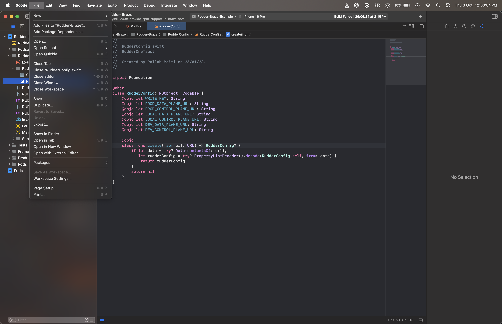
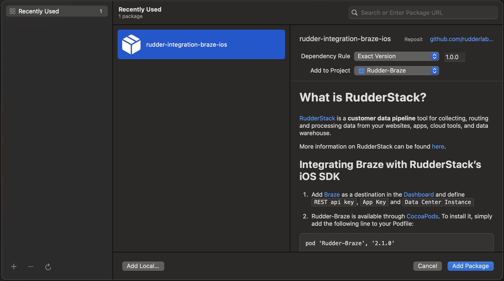

# What is RudderStack?

[RudderStack](https://rudderstack.com/) is a **customer data pipeline** tool for collecting, routing and processing data from your websites, apps, cloud tools, and data warehouse.

More information on RudderStack can be found [here](https://github.com/rudderlabs/rudder-server).

## Integrating Braze with RudderStack's iOS SDK

1. Add [Braze](https://www.braze.com) as a destination in the [Dashboard](https://app.rudderstack.com/) and define ```REST api key```, ```App Key``` and ```Data Center Instance```

2. Rudder-Braze is available through [CocoaPods](https://cocoapods.org) and [Swift Package Manager (SPM)](https://www.swift.org/documentation/package-manager/).

## Cocoapods
Add the following line to your Podfile and followed by `pod install`:

```ruby
pod 'Rudder-Braze', '2.2.0'
```

## Swift Package Manager (SPM)
You can also add the SDK via Swift Package Mangaer.

* Go to **File** -> **Add Package Dependencies...**, as shown:



* Enter the package repository (`https://github.com/rudderlabs/rudder-integration-braze-ios`) in the search bar.

*  In **Dependency Rule**, select **Exact Version** and enter latest as the value, as shown:



* Select the project to which you want to add the package.

* Finally, click on **Add Package**.

## Initialize ```RSClient```

Put this code in your ```AppDelegate.m``` file under the method ```didFinishLaunchingWithOptions```
```
RSConfigBuilder *configBuilder = [[RSConfigBuilder alloc] init];
[configBuilder withDataPlaneUrl:DATA_PLANE_URL];
[configBuilder withFactory:[RudderBrazeFactory instance]];
RSClient *rudderClient = [RSClient getInstance:WRITE_KEY config:[configBuilder build]];
```

## Send Events

Follow the steps from the [RudderStack iOS SDK](https://github.com/rudderlabs/rudder-sdk-ios).

## Sending push notification events

To send your push notification events to Braze, follow these steps:

1. Follow this [Braze](https://www.braze.com/docs/developer_guide/platform_integration_guides/swift/push_notifications/integration/#push-notification-certificate) guide to generate the `Push Notification Certificate`.

2. Add the following code to the `application:didFinishLaunchingWithOptions:` method of your app delegate.

```
dispatch_async(dispatch_get_main_queue(), ^{
    [[UIApplication sharedApplication] registerForRemoteNotifications];

    UNUserNotificationCenter *center = UNUserNotificationCenter.currentNotificationCenter;
    [center setNotificationCategories:BRZNotifications.categories];
    center.delegate = self;
    UNAuthorizationOptions options = UNAuthorizationOptionAlert | UNAuthorizationOptionSound | UNAuthorizationOptionBadge;
    if (@available(iOS 12.0, *)) {
        options = options | UNAuthorizationOptionProvisional;
    }
    [center requestAuthorizationWithOptions:options
                          completionHandler:^(BOOL granted, NSError *_Nullable error) {
        NSLog(@"Notification authorization, granted: %d, "
              @"error: %@)",
              granted, error);
    }];
});
```

3. Add these handlers for the tokens and push notifications:

```
// - Register the device token with Braze

- (void)application:(UIApplication *)application didRegisterForRemoteNotificationsWithDeviceToken:(NSData *)deviceToken {
    [self waitForBrazeSDKToInit:10.f];
    if ([RudderBrazeFactory instance].integration) {
        [[RudderBrazeFactory instance].integration didRegisterForRemoteNotificationsWithDeviceToken:deviceToken];
    }
}

-(void)waitForBrazeSDKToInit:(NSTimeInterval)timeInterval {
    if ([RudderBrazeFactory instance].integration == nil) {
        [NSThread sleepForTimeInterval:timeInterval];
    }
}

// - Add support for silent notification

- (void)application:(UIApplication *)application didReceiveRemoteNotification:(NSDictionary *)userInfo fetchCompletionHandler: (void (^)(UIBackgroundFetchResult))completionHandler {
    if ([RudderBrazeFactory instance].integration) {
        [[RudderBrazeFactory instance].integration didReceiveRemoteNotification:userInfo fetchCompletionHandler:completionHandler];
    }
}

// - Add support for push notifications

- (void)userNotificationCenter:(UNUserNotificationCenter *)center didReceiveNotificationResponse:(UNNotificationResponse *)response withCompletionHandler:(void (^)(void))completionHandler {
    if ([RudderBrazeFactory instance].integration) {
        [[RudderBrazeFactory instance].integration didReceiveNotificationResponse:response withCompletionHandler:completionHandler];
    }
}

// - Add support for displaying push notification when the app is currently running in the foreground

- (void)userNotificationCenter:(UNUserNotificationCenter *)center willPresentNotification:(UNNotification *)notification withCompletionHandler: (void (^)(UNNotificationPresentationOptions))completionHandler {
    if (@available(iOS 14, *)) {
        completionHandler(UNNotificationPresentationOptionList |
                          UNNotificationPresentationOptionBanner);
    } else {
        completionHandler(UNNotificationPresentationOptionAlert);
    }
}
```

## Sending In-App Message events

1. Add the following line to your ```Podfile```:
```ruby
pod 'BrazeUI'
```

2. Next, navigate to the directory of your Xcode app project within your terminal and run the following command:
```
pod install
```

3. Import the BrazeUI SDK in your ```AppDelegate.m``` file:
```
@import BrazeUI;
```

4. Next, add a static variable to your ```AppDelegate.m``` file to keep a reference to the Braze instance throughout your application’s lifetime:
```
static Braze *braze;
```

5. Just after the ```Rudder iOS``` SDK initialisation code snippet, add below code in your ```AppDelegate.m``` file:
```
id<RSIntegrationFactory> brazeFactoryInstance = [RudderBrazeFactory instance];
[[RSClient getInstance] onIntegrationReady:brazeFactoryInstance withCallback:^(NSObject *brazeInstance) {
    if (brazeInstance && [brazeInstance isKindOfClass:[Braze class]]) {
        braze = (Braze *)brazeInstance;
        [self configureIAM];
    } else {
        NSLog(@"Error getting Braze instance.");
    }
}];
```

6. Add the ```configureIAM``` method in the ```AppDelefate.m``` file:
```
-(void) configureIAM {
    // Refer here: https://www.braze.com/docs/developer_guide/platform_integration_guides/swift/in-app_messaging/customization/setting_delegates/#setting-the-in-app-message-delegate
    BrazeInAppMessageUI *inAppMessageUI = [[BrazeInAppMessageUI alloc] init];
    braze.inAppMessagePresenter = inAppMessageUI;
}
```
**Note:** In-App Message support for iOS device mode integration is supported from `Rudder-Braze` version `1.4.0` onwards.

Refer to the [Rudder sample app](https://github.com/rudderlabs/rudder-integration-braze-ios/blob/master/Example/Rudder-Braze/RUDDERAppDelegate.m) for implementation detail.

## Contact Us

If you come across any issues while configuring or using this integration, please feel free to start a conversation on our [Slack](https://resources.rudderstack.com/join-rudderstack-slack) channel. We will be happy to help you.
